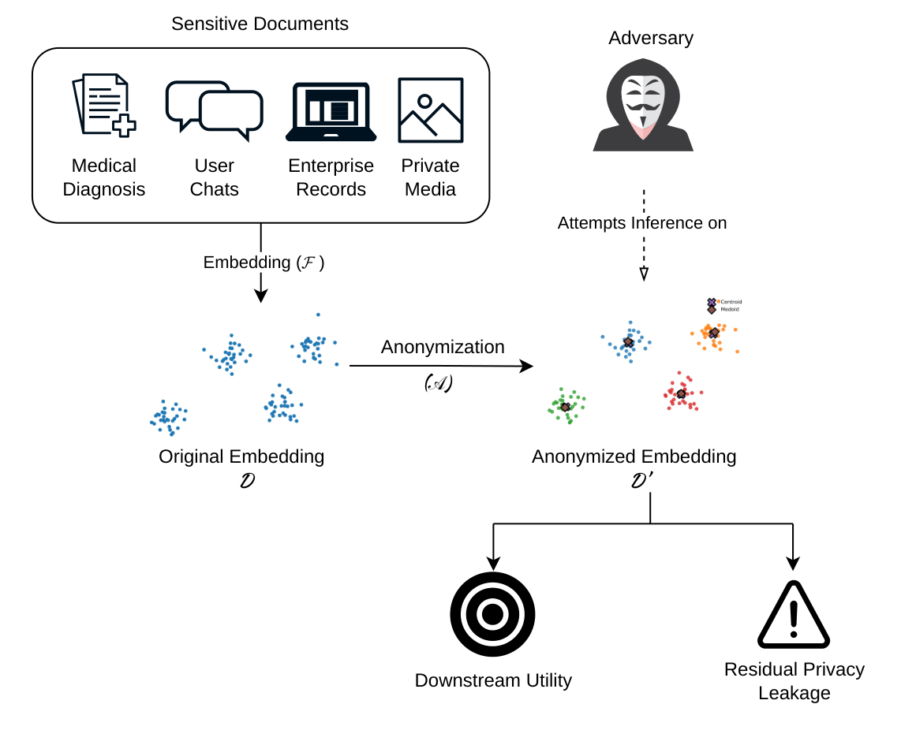
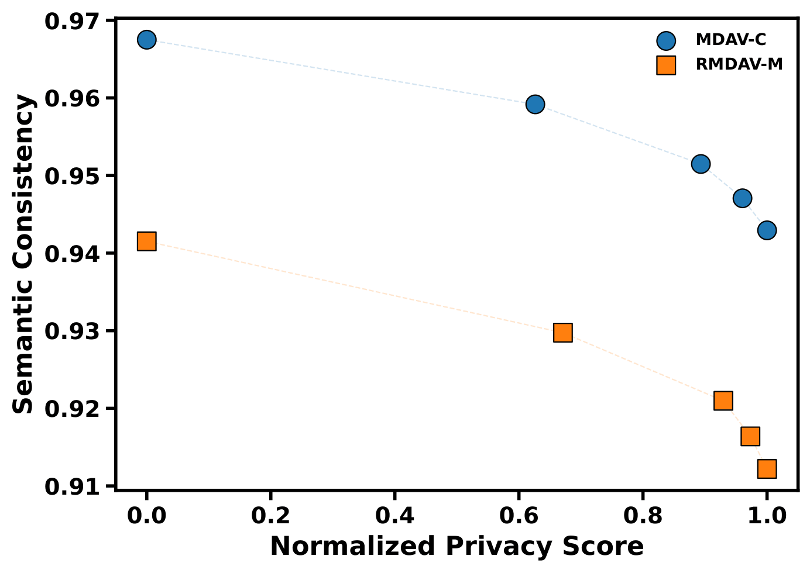
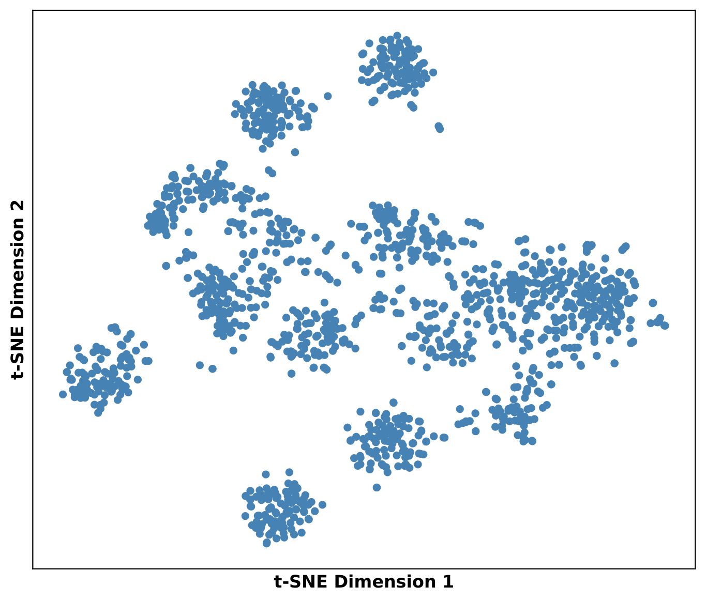
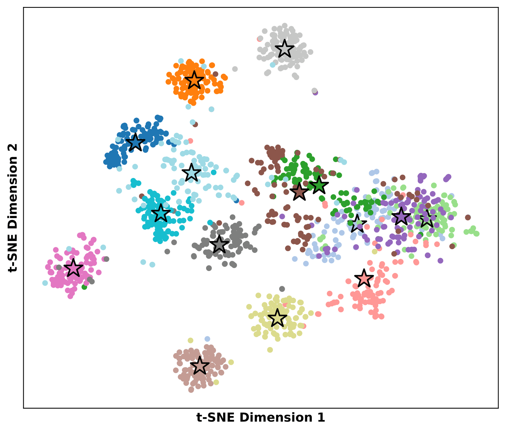
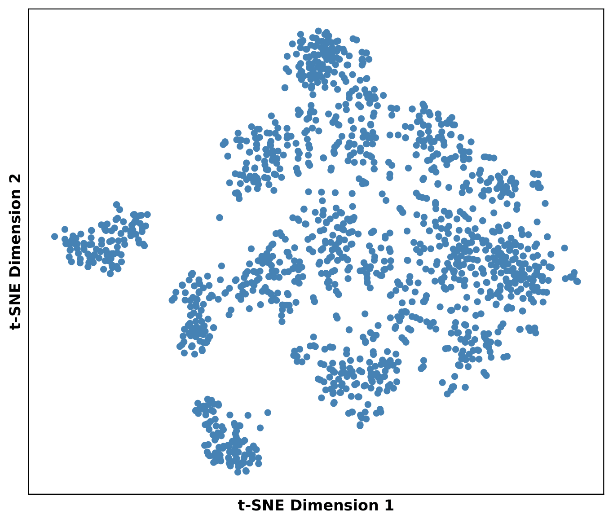
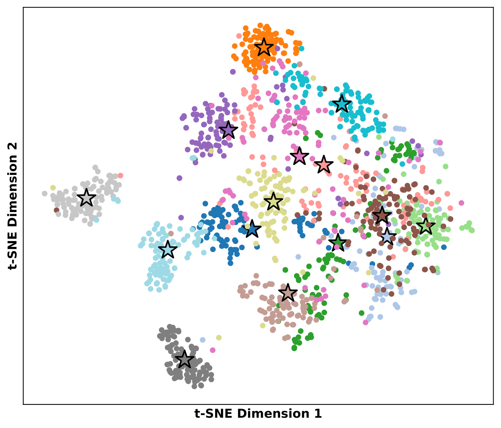

# Syntactic Anonymization Schemes for Preventing Template Inversion in Vector Databases

[](https://www.python.org/)
[](LICENSE)

Official implementation accompanying the research paper:

**Syntactic Anonymization Schemes for Preventing Template Inversion in Vector Databases**

> **Status:** Submitted for publication

GitHub Repository:
https://github.com/vkmanojk/Syntactic-Vector-Anonymization

---

## Overview

Vector databases have become the backbone of modern semantic retrieval systems and Retrieval-Augmented Generation (RAG) pipelines by storing dense vector representations of text and other modalities. Although these embeddings do not explicitly reveal the original data, recent studies have shown that they are vulnerable to **template inversion attacks**, where adversaries attempt to reconstruct sensitive textual information directly from embedding vectors.

This repository presents two syntactic anonymization schemes designed to mitigate template inversion attacks while preserving the semantic structure required for downstream retrieval tasks.

The proposed anonymization schemes are inspired by the concept of **k-anonymity** and perform microaggregation directly in the embedding space.

The repository implements:

- **MDAV-C** (Maximum Distance to Average Vector with Centroid Replacement)
- **RMDAV-M** (Randomized MDAV with Medoid Replacement)

The proposed methods are evaluated using multiple privacy and utility metrics, including:

- Mutual Information Estimation
- Semantic Consistency
- Retrieval Consistency
- Template Inversion Evaluation
  - BLEU Score
  - BERTScore-F1

The complete experimental pipeline used in the paper is included to enable full reproducibility.

---

## Repository Highlights

- Complete implementation of **MDAV-C** anonymization
- Complete implementation of **RMDAV-M** anonymization
- Utility evaluation framework
- Mutual Information estimation using the **MINDE** framework
- Template inversion using a SciFive-based decoder
- Automatic training of the inversion model if no pretrained model is found
- Automatic generation of all figures presented in the paper
- Modular source code organized into reusable Python packages
- Jupyter notebooks for reproducing every experiment

---

## Repository Structure

```text
Syntactic-Vector-Anonymization/
│
├── data/
│   ├── case_embeddings.parquet
│   ├── case_texts.parquet
│   ├── anonymized_outputs/
│   ├── results/
│   └── figures/
│
├── docs/
│   └── figures/
│
├── notebooks/
│   ├── 01_anonymization.ipynb
│   ├── 02_utility_evaluation.ipynb
│   ├── 03_mutual_information.ipynb
│   ├── 04_template_inversion.ipynb
│   └── 05_visualization.ipynb
│
├── src/
│   ├── anonymization/
│   ├── evaluation/
│   └── inversion/
│
├── requirements.txt
├── requirements-mi.txt
├── LICENSE
└── README.md
```

---

# Installation

The project was developed using

- **Python 3.11**
- **PyTorch**
- **CUDA-enabled GPU**

Although most experiments can also be executed on a CPU, a CUDA-enabled GPU is recommended, particularly for template inversion experiments.

---

## Clone the Repository

```bash
git clone https://github.com/vkmanojk/Syntactic-Vector-Anonymization.git

cd Syntactic-Vector-Anonymization
```

---

# Environment Setup

The project uses **two separate Python environments**.

The primary environment is used for all anonymization and evaluation experiments, while a separate environment is recommended for Mutual Information estimation because the external MINDE framework depends on a different software stack.

---

## Environment 1 — Main Project

Create a virtual environment.

### Windows

```bash
python -m venv .venv
```

Activate it.

```bash
.venv\Scripts\activate
```

Install the required packages.

```bash
pip install -r requirements.txt
```

This environment is used for

- Anonymization
- Utility Evaluation
- Template Inversion
- Visualization

---

## Environment 2 — Mutual Information Estimation

Create a second virtual environment.

```bash
python -m venv mi
```

Activate it.

```bash
mi\Scripts\activate
```

Install the required packages.

```bash
pip install -r requirements-mi.txt
```

This environment is used only for Mutual Information estimation using the external **MINDE** implementation.

Keeping the Mutual Information experiments in a separate environment avoids dependency conflicts with the main project.

# Dataset Preparation

The experiments presented in this repository are performed using the **MultiCaRe** clinical case report dataset.

Dataset:

https://zenodo.org/records/15310586

Download the dataset and place the required files inside the `data/` directory.

The following files are required:

```text
data/
├── case_embeddings.parquet
└── case_texts.parquet
```

- `case_embeddings.parquet` contains the original embedding vectors used throughout the anonymization experiments.
- `case_texts.parquet` contains the corresponding clinical case reports used for template inversion evaluation.

The dataset itself is **not included** in this repository due to licensing and size constraints.

---

# External Dependency: MINDE

Mutual Information estimation is performed using the external **MINDE** framework.

Clone the repository alongside this project.

```bash
git clone https://github.com/MustaphaBounoua/MINDE.git
```

After cloning, the directory structure should resemble

```text
Syntactic-Vector-Anonymization/
│
├── minde/
├── data/
├── notebooks/
├── src/
└── ...
```

---

# Running the Experiments

After downloading the dataset and setting up the required environments, execute the notebooks sequentially.

The notebooks are numbered according to the experimental pipeline.

## 1. Anonymization

```text
01_anonymization.ipynb
```

This notebook

- Loads the original embedding dataset
- Generates anonymized embeddings using MDAV-C
- Generates anonymized embeddings using RMDAV-M
- Saves all anonymized embeddings under

```text
data/anonymized_outputs/
```

---

## 2. Utility Evaluation

```text
02_utility_evaluation.ipynb
```

This notebook evaluates the utility preserved after anonymization.

Computed metrics include

- Semantic Consistency
- Retrieval Consistency

The generated results are stored under

```text
data/results/
```

---

## 3. Mutual Information Estimation

```text
03_mutual_information.ipynb
```

Run this notebook using the **Mutual Information virtual environment**.

The notebook

- Loads the anonymized embeddings
- Estimates Mutual Information using MINDE
- Stores the results under

```text
data/results/
```

---

## 4. Template Inversion

```text
04_template_inversion.ipynb
```

This notebook evaluates the resistance of anonymized embeddings against template inversion attacks.

If a previously trained inversion model is found inside

```text
saved_inversion_model/
```

the model is loaded automatically.

Otherwise,

- a new inversion model is trained,
- saved for future use,
- and subsequently used for evaluation.

Template inversion performance is evaluated using

- BLEU
- BERTScore-F1

All reconstruction outputs and evaluation results are saved under

```text
data/results/template_inversion/
```

---

## 5. Visualization

```text
05_visualization.ipynb
```

This notebook reproduces all quantitative figures presented in the paper directly from the generated experimental results.

Figures are automatically saved under

```text
data/figures/
```

No manual editing or hard-coded values are required.

---

# Generated Outputs

After executing all notebooks, the repository will automatically generate the following outputs.

```text
data/
│
├── anonymized_outputs/
│
├── results/
│   ├── utility_results.csv
│   ├── mutual_information.csv
│   └── template_inversion/
│       ├── summary.csv
│       ├── mdav/
│       └── rmdav/
│
└── figures/
```

These generated outputs are sufficient to reproduce every quantitative result reported in the associated paper.

---

# Source Code

The implementation is organized into modular Python packages located under

```text
src/
```

The main modules are

```text
src/
├── anonymization/
│   ├── mdav.py
│   └── rmdav.py
│
├── evaluation/
│   ├── retrieval.py
│   ├── semantic.py
│   └── metrics.py
│
└── inversion/
    ├── model.py
    ├── training.py
    ├── reconstruction.py
    └── metrics.py
```

The source code is designed to be reusable outside the provided notebooks and can be imported directly into other Python projects.

# Figures

The `docs/figures/` directory contains representative figures from the associated paper that illustrate the proposed framework and summarize the key experimental findings.

## System Model

The following figure presents the overall system model considered in this work. It illustrates the generation of text embeddings, the proposed anonymization process, storage in the vector database, semantic retrieval, and the template inversion threat model addressed by the proposed anonymization schemes.

<p align="center">
    
</p>

---

## Privacy–Utility Trade-off

The following figure illustrates the privacy–utility trade-off achieved by the proposed anonymization schemes. As the anonymity level increases, stronger privacy protection is obtained while maintaining high semantic consistency.

<p align="center">
    
</p>

---

## t-SNE Visualizations

To qualitatively illustrate the effect of the proposed anonymization schemes on the embedding space, representative t-SNE visualizations are provided below.

### MDAV-C

The first figure shows the original embedding distribution, while the second figure shows the corresponding clusters formed after applying **MDAV-C**.

<p align="center">
    
    
</p>

### RMDAV-M

Similarly, the following figures show the original embedding distribution and the anonymized clusters obtained using **RMDAV-M**.

<p align="center">
    
    
</p>

---

# Reproducibility

This repository is designed to fully reproduce the experiments presented in the accompanying research paper.

After setting up the required environments, downloading the dataset, and executing the notebooks sequentially, users can reproduce

- MDAV-C and RMDAV-M anonymized embeddings
- Utility evaluation
- Mutual Information estimation
- Template inversion experiments
- Publication-quality figures

All intermediate files and experimental results are generated automatically. No manual modification of intermediate outputs is required.

---

# Citation

If you use this repository in your research, please cite the associated paper.

> **Syntactic Anonymization Schemes for Preventing Template Inversion in Vector Databases**

The manuscript is currently under review. Citation information and a DOI will be added upon publication.

---

# Acknowledgements

This work builds upon several outstanding open-source projects and publicly available resources. We gratefully acknowledge their authors and contributors.

In particular, we thank

- **MultiCaRe** for providing the clinical case report dataset used throughout this work.
- **SciFive** for the biomedical sequence-to-sequence language model employed in the template inversion experiments.
- **MINDE** for the Mutual Information estimation framework.
- **Hugging Face Transformers** for providing pretrained model implementations.
- The developers and contributors of **PyTorch**, **scikit-learn**, **NumPy**, **Pandas**, **Matplotlib**, and the broader open-source Python ecosystem.

Their contributions have been invaluable to this research.

---

# License

This project is released under the **MIT License**.

See the [LICENSE](LICENSE) file for details.

---

# Contact

If you have questions, encounter issues, or would like to suggest improvements, please open an issue on the GitHub repository.

**GitHub Repository**

https://github.com/vkmanojk/Syntactic-Vector-Anonymization

---

## ⭐ Support the Project

If you find this repository useful in your research, please consider giving it a ⭐ on GitHub.

Your support helps improve the visibility of this work and encourages further research on privacy-preserving vector databases.

---

**© 2026 Manoj Kumar**

Repository accompanying the research paper:

**Syntactic Anonymization Schemes for Preventing Template Inversion in Vector Databases**
